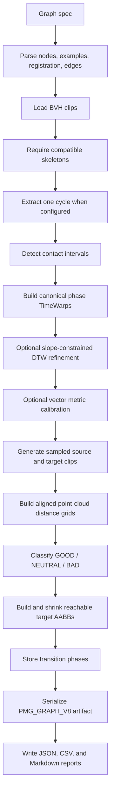
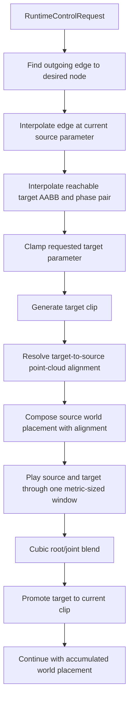

# Design

## Purpose

Provide an inspectable paper-core PMG implementation whose offline output is the
exact artifact consumed online. This document defines the complete path from
authored BVH examples to a streamed world-space pose, organized around contracts
and failure boundaries.

## Module overview

```text
GraphSpec
  -> BuildPmgArtifactFromSpec
      -> cycle extraction
      -> contact registration
      -> optional DTW refinement
      -> PmgBuilder edge sampling
  -> BuiltPmgArtifact            (offline/online seam)
      -> GraphIo V8
      -> RuntimeController
      -> GoalDirectedLocomotion
```

`BuiltPmgArtifact` is the offline/online seam. It owns the Skeleton,
ParametricMotionGraph, runtime frame configuration, registration metadata, edge
sampling configuration, seeds, and build reports.

## Offline pipeline



### Inputs

- Graph spec path.
- BVH files referenced by the spec.
- Parameter vector for every example.
- Registration settings.
- Parameter metrics and calibration samples per axis.
- Edge thresholds, sample counts, and seed.
- Runtime sampling rate and transition-window settings.

### Fixed conventions

- Root floor plane: `(x, z)`; vertical axis: `+Y`.
- Floor transform: yaw, then `(dx, dz)` translation.
- Phase: normalized `[0, 1]`.
- Rotations: local joint quaternions.
- Distance/unit scale: native BVH units.
- Turn-rate metric: radians per second; travel-speed metric: native BVH
  units per second.

### Node construction

Each `GraphSpecNode` becomes one `ParametricMotionSpace`. For each example:

1. Load BVH hierarchy and channels.
2. Require skeleton compatibility with the first example.
3. Optionally extract the first cycle between two strikes of `cycle_joint`.
4. Add the clip at its authored parameter.

Registration then detects contact intervals and maps canonical phase to each
example's phase. DTW refinement may add interior knots but cannot move contact
anchors.

### Parameter synthesis

Uncalibrated spaces clamp the request to the authored domain, choose at most
`dimension + 1` nearest examples, and apply normalized reciprocal-distance
weights. Calibrated spaces declare one metric per parameter axis, derive the
target measured vector from authored example anchors, normalize metric-space
distances by sampled range, and invert nearby sampled measured vectors to full
example weights. One-dimensional calibration retains monotone adjacent-segment
sampling; multidimensional calibration uses a deterministic regular
authored-domain grid.

Generated clip duration is the weighted example duration. Root floor movement is
integrated from blended heading-local deltas.

### Edge construction

For each sampled source parameter:

1. Generate the source clip.
2. Compare it with every generated target clip.
3. Find the minimum distance cell in the configured source/target phase ranges.
4. Classify the target sample.
5. Build an AABB around GOOD parameters.
6. Shrink the AABB to exclude sampled BAD parameters.
7. Keep phase samples for retained GOOD parameters inside the final AABB.

The edge build fails immediately when one sampled source has no GOOD target, an
empty adjusted box, no retained GOOD target inside the box, or a sampled BAD
target still inside the box.

### Artifact boundary

```text
BuiltPmgArtifact
  skeleton
  graph
    nodes
      registered motion spaces
      parameter calibrations
    edges
      source samples
      reachable target boxes
      scalar phase summaries
      target-dependent phase samples
  metadata
    units, source paths, runtime frame rate
    registration config, edge config, seeds
    edge build reports
```

V8 is the current writer format (adds the edge transition-window metric
convention). V2–V7 remain readable with documented fallbacks and pin the
legacy `kKovarDirectional` metric. Graph runtime requires a V4+ artifact with a
non-empty Skeleton.

## Online pipeline



### Scheduling contract

The transition window is **two separate concerns**, each from a different
source paper:

- **Metric window (build, Kovar §3.1).** PMG reuses Kovar's distance metric,
  whose windows are directional: source `[i, i+k-1]`, target `[j-k+1, j]`. The
  asymmetry aligns the end→start concatenation seam, and the calibrated phase
  sub-ranges + raw-sum thresholds depend on it. `PmgBuilderConfig::transition_convention`
  is `kKovarDirectional`. Stored phases are references under this metric.
- **Blend placement (runtime, PMG §5.2.1).** The runtime centers the blend
  window on the stored optimal transition point (`RuntimeControllerConfig::convention`
  = `kPmgCentered` by default), gating half a window early so the optimal point
  gets maximum blend weight. This is independent of the metric and is not coupled
  in `RuntimeControllerConfigFromArtifact`.

The blend length equals the edge metric's `DistanceGridConfig::window_size`,
whose `k` sampled frames span `k-1` intervals, so the blend lasts `(k-1)/fps`.
Because the centered blend window is `[ref-h, ref+h]` while the directional
metric window is `[i, i+k-1]`, the blended frames differ from the metric-scored
frames by half a window — an inherent consequence of pairing Kovar's metric with
PMG's centered blend (in pure PMG they coincide). Both layers resolve their
support through the shared `ResolveTransitionFrameWindows`. Both clips advance
through the full blend and completed cycles fold into world placement instead of
freezing at clip end. Artifacts with inconsistent edge window sizes are rejected
because the runtime currently has one global transition window.

### Runtime request contract

`RuntimeControlRequest` contains `desired_node` (target graph node index) and
`desired_parameter` (parameter vector in that node's coordinates). The runtime
ignores requests with no matching outgoing edge or incorrect target dimension,
and clamps valid requests to the interpolated reachable target box.

### Alignment contract

`PointCloudAlignment` builds source and target point clouds at interpolated
transition phases, computes the target-to-source `RigidTransform2D`, and composes
it with current world placement. `RootOnlyAlignment` is a skeleton-free
debug/test adapter, not the paper path.

## Control layers

- **Random walk.** `ChooseRandomOutgoingTransition` selects only actual outgoing
  edges and samples the target node's parameter domain with the supplied RNG.
- **Goal-directed locomotion.** `GoalDirectedLocomotion` steers every axis of a
  registered node. Per axis it simulates fixed parameter values through the real
  runtime and measures the achieved metric (turn rate or travel speed), building
  one inverse map per axis. At runtime the `turn_rate` axis converts heading
  error to a desired rate (with a swing-through branch for targets behind), the
  `travel_speed` axes cruise at their fastest achievable pace and ease toward
  their slowest within `arrival_speed_distance` of the goal, and
  `RuntimeController` clamps the assembled vector to the reachable box. A
  one-dimensional `turn_rate` node reduces to the prior single-axis behavior.
  This is a local greedy controller, not the 2002 paper's generic
  branch-and-bound search.

## Viewer

The optional viewer has one compile-time seam:

```text
ViewerHost -> ViewerWorkspace Interface -> PmgViewerWorkspace Adapter
           -> RenderScene -> OpenGL renderer
```

`ViewerHost` owns camera, rendering, and window input without linking
`pmg_core`. The Adapter owns PMG playback and diagnostics and translates them
into the algorithm-neutral `RenderScene`; Adapter selection is compile-time
(runtime library loading is not supported). The Adapter exposes Inputs, Motion
Space, Transition Grid, PMG Runtime, and Display diagnostic views. The viewer is
an inspection surface; core graph behavior lives in `pmg_core`. Goal-directed
goto steers multidimensional first nodes through the full per-axis steering
vector; manual slider streaming drives axis 0 and holds the remaining axes at
their midpoint. Incompatible artifacts fail explicitly.

The PMG Runtime view retains a bounded world-root trail and transition-event
markers keyed by source/target edge. These are viewer-owned diagnostic history;
they do not alter controller state or artifact semantics. During an active
transition, the pipeline view reconstructs the exact metric support from the
artifact's per-edge build convention and displays it beside the exact runtime
blend support already reported by `RuntimeController`. This makes the
directional-metric/centered-blend policy explicit without duplicating transition
selection or alignment logic.

## Failure boundaries

The implementation throws close to the invalid input for: missing or malformed
files; incompatible skeleton hierarchy, channels, or offsets; unknown node or
joint names; invalid parameter dimensions; empty clips or spaces; incompatible
contact structures; DTW requested without contact registration; invalid sample
counts or threshold ordering; source samples without valid target regions;
malformed artifacts; runtime window mismatch; and unsteerable goal-directed
nodes.

## Output layout

```text
outputs/<run_name>/
|-- artifact.pmg
|-- config.json
|-- metrics.json
|-- report.md
`-- tables/
    `-- edge_samples.csv
```

The artifact is the runtime input. JSON/CSV/Markdown files are human-readable
build evidence.

## Limitations

The full prioritized deviation list lives in
[PAPER_CONFORMANCE.md](PAPER_CONFORMANCE.md). Structural highlights:

- Parameter-accuracy calibration supports one metric per parameter axis using
  deterministic sampled inversion (signed turn rate and mean root travel speed).
- Manual GraphSpec parameterization replaces Kovar-Gleicher automatic database
  extraction and parameterization.
- The included corpus validates walking/jogging behavior, not the original
  boxing/platform experiments.
- Transition regions are axis-aligned boxes and clips transition near their end;
  per-edge phase ranges are configurable, but general mid-clip graph
  transitions are not a runtime authoring feature.
- Goal-directed control steers declared `turn_rate` and `travel_speed` axes.
  Sparse/coupled corpus support remains a spec-level limitation; see
  [SPEC_AUDIT.md](SPEC_AUDIT.md).
- Foot locking is optional and not serialized as runtime behavior.
