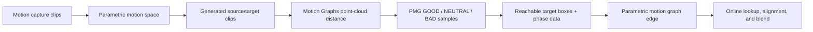

# Paper Guide

## Purpose

Explain how *Motion Graphs* (2002) and *Parametric Motion Graphs* (2007) combine
into the system implemented here.

The short version:

```text
Motion Graphs
  supplies transition similarity, floor alignment, blending, and graph-walk ideas

Parametric Motion Graphs
  lifts each discrete motion into a continuous parameterized motion space
  and represents valid transitions between those spaces by sampling

This repository
  implements the PMG paper-core over manually authored BVH motion spaces,
  with reproducible artifacts and a small online controller
```

## Source Papers

### Motion Graphs

Kovar, Gleicher, and Pighin (2002) build a directed graph from motion-capture
clips. Graph edges contain original motion or generated transitions. A graph
walk becomes a new motion stream.

Main contributions used by this repository:

- compare motion windows through aligned point clouds;
- solve the best floor-plane yaw and translation in closed form;
- create a short transition by blending aligned source and target motion;
- accumulate rigid placement while traversing the graph.

Main contributions not implemented here:

- automatic all-pairs transition harvesting from a large database;
- local-minimum extraction over the complete distance function;
- label-specific largest-strongly-connected-component pruning;
- generic branch-and-bound graph-walk search;
- path fitting and constraint-annotation propagation.

### Parametric Motion Graphs

Heck and Gleicher (2007) replace each discrete action node with a continuous
parametric motion space. A node can represent, for example, walking clips
parameterized by turn amount. An edge no longer says only "clip A can follow
clip B." It maps a source parameter to:

- a reachable target parameter region;
- source and target transition phases;
- enough information to recompute alignment at runtime.

The paper constructs an edge by sampling source and target parameter spaces,
classifying target samples with `TGOOD` and `TBAD`, enclosing GOOD samples in
an axis-aligned box, and shrinking the box to exclude BAD samples.

At runtime, nearby source transition samples are interpolated using the
paper's Equations 1-3.

## Conceptual Relationship



The 2002 paper supplies the clip-to-clip transition test. The 2007 paper uses
that test repeatedly over sampled parameter values to build transitions between
continuous spaces.

## Motion Graphs Algorithm

### 1. Windowed point clouds

For candidate source and target frames, form corresponding point clouds over a
short time window. A window captures more than pose: frame-to-frame movement
also influences the distance.

For candidate pair `(i, j)` and window length `k`, the source window is
`[i, i+k-1]` and the target window is `[j-k+1, j]`, matching Kovar Section 3.1.
Repository endpoints are clamped when a configured phase range reaches a clip
boundary.

The paper recommends mesh-derived points. This repository uses skeleton joint
world positions because the BVH corpus has no skin mesh.

### 2. Optimal floor alignment

The second cloud may rotate about the vertical axis and translate on the floor.
The paper minimizes weighted squared point distance:

```text
min over yaw, dx, dz:
    sum_i w_i ||p_i - T(yaw, dx, dz) p'_i||^2
```

The closed-form yaw uses weighted floor-plane dot and cross terms. Translation
aligns the weighted floor-plane centroids.

Repository distance is this unnormalized weighted sum. Absolute thresholds
therefore scale with point count, window length, configured weights, and native
BVH units; they remain corpus/configuration specific.

### 3. Transition blend

After alignment, root positions are linearly interpolated and joint rotations
use spherical interpolation. A cubic blend curve gives zero endpoint slope.

The repository uses target weight:

```text
alpha(s) = 3s^2 - 2s^3, s in [0, 1]
```

This is the complement of the source-weight convention printed in the 2002
paper.

### 4. Full Motion Graphs system

The original system extracts many transition candidates, prunes graph
connectivity, propagates constraints, and searches graph walks. Those operations
are not prerequisites for the PMG edge representation and are outside this
repository's scope.

## Parametric Motion Graph Algorithm

### 1. Parametric node

A node represents a smooth function:

```text
P(lambda) -> motion clip
```

where `lambda` is a continuously valued parameter vector.

This repository implements `P` as `ParametricMotionSpace`. Authored BVH examples
are registered to a canonical phase, blended locally, and optionally calibrated
against measured turn rate.

### 2. Sample one directed edge

For source samples `Ls` and target samples `Lt`:

1. Generate one source clip for each sampled source parameter.
2. Generate one target clip for each sampled target parameter.
3. Find the best transition phase pair and distance for every sampled pair.
4. Classify target samples:

```text
distance <= TGOOD             -> GOOD
TGOOD < distance < TBAD       -> NEUTRAL
distance >= TBAD              -> BAD
```

5. Enclose GOOD target parameters in an axis-aligned bounding box.
6. Shrink the box until no sampled BAD point remains inside.
7. Reject the entire edge if any sampled source parameter has no valid box.

This is sampled evidence. It does not prove that every unsampled source
parameter has a valid transition.

### 3. Store transition data

The paper stores, per source sample:

- source parameter;
- reachable target bounding box;
- average normalized source/target transition point.

V6 introduced retained GOOD target phase samples alongside scalar compatibility
fields. V7 retains both, so runtime can vary the phase pair with the requested
target parameter.

### 4. Runtime interpolation

For source parameter `lambda` in dimension `d`:

1. Select up to `k = d + 1` nearest source transition samples.
2. Compute the paper's compact inverse-distance weights.
3. Interpolate target box bounds and transition phases.
4. Clamp the requested target parameter to the reachable box.
5. Generate the target clip.
6. Recompute point-cloud alignment.
7. Blend over the same frame count used by the transition metric.

Interpolating min/max box corners is equivalent to interpolating center/width
when all weights sum to one.

## Repository Scope

### Implemented paper-core

- BVH loading and skeleton compatibility checks.
- Contact-based cycle extraction and canonical phase registration.
- Optional slope-constrained DTW registration refinement.
- Local parameter interpolation and vector metric calibration.
- Parameter-dependent generated clip duration.
- Point-cloud transition distance and floor alignment.
- Sampled PMG edge construction and lookup.
- Complete V8 offline artifact.
- Runtime alignment, blend, random walk, and goal-directed locomotion.

### Local extensions

- Include authored example parameters in the random sample set.
- Preserve target-dependent transition phase samples.
- Serialize skeleton, settings, seeds, reports, and compatibility metadata.
- Root-delta integration for generated clips.
- Optional contact detection and foot locking.
- Runtime/viewer diagnostics for the full transition chain.

### Not reproduced

- Original boxing, platform, chair, and full locomotion datasets.
- Kovar-Gleicher 2004 automatic motion extraction and parameterization.
- Mesh-vertex point clouds.
- Full Motion Graphs database construction and global search.
- The paper's broad claims about motion fidelity or control accuracy.

## Claim Boundary

Safe claim:

> The repository implements and tests a sampled PMG transition pipeline using
> BVH examples, joint-position point clouds, registered local blends, and an
> artifact-driven runtime.

Unsafe claim:

> The repository reproduces the original papers' complete system or proves
> equivalent animation quality.
