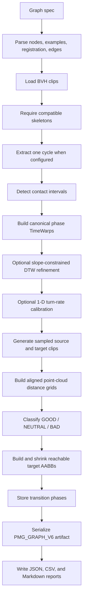
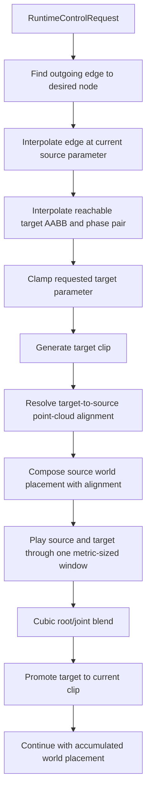

# Pipeline

## Purpose

Define the complete path from authored BVH examples to a streamed world-space
pose. This document is organized around contracts and failure boundaries.

## Offline Pipeline



### Inputs

- Graph spec path.
- BVH files referenced by the spec.
- Parameter vector for every example.
- Registration settings.
- Edge thresholds, sample counts, and seed.
- Runtime sampling rate and transition-window settings.

### Fixed conventions

- Root floor plane: `(x, z)`.
- Vertical axis: `+Y`.
- Floor transform: yaw, then `(dx, dz)` translation.
- Phase: normalized `[0, 1]`.
- Rotations: local joint quaternions.
- Distance/unit scale: native BVH units.
- Turn-rate metric: radians per second.

### Node construction

Each `GraphSpecNode` becomes one `ParametricMotionSpace`.

For each example:

1. Load BVH hierarchy and channels.
2. Require skeleton compatibility with the first example.
3. Optionally extract the first cycle between two strikes of `cycle_joint`.
4. Add the clip at its authored parameter.

Registration then detects contact intervals and maps canonical phase to each
example's phase. DTW refinement may add interior knots but cannot move contact
anchors.

### Parameter synthesis

Uncalibrated spaces:

- clamp request to the authored domain;
- choose at most `dimension + 1` nearest examples;
- apply normalized reciprocal-distance weights.

Calibrated 1-D turn-rate spaces:

- locate the adjacent parameter segment;
- derive the target measured turn rate from example anchors;
- invert the sampled `(blend_t, measured_rate)` curve;
- blend only the two segment examples.

Generated clip duration is the weighted example duration. Root floor movement
is integrated from blended heading-local deltas.

### Edge construction

For each sampled source parameter:

1. Generate the source clip.
2. Compare it with every generated target clip.
3. Find the minimum distance cell in the configured source/target phase ranges.
4. Classify the target sample.
5. Build an AABB around GOOD parameters.
6. Shrink the AABB to exclude sampled BAD parameters.
7. Keep phase samples for retained GOOD parameters inside the final AABB.

The edge build fails immediately when one sampled source has:

- no GOOD target;
- an empty adjusted box;
- no retained GOOD target inside the box;
- a sampled BAD target still inside the box.

### Artifact boundary

`BuiltPmgArtifact` is the offline/online boundary:

```text
BuiltPmgArtifact
  skeleton
  graph
    nodes
      registered motion spaces
      parameter calibrations
    edges
      source samples
      reachable target boxes
      scalar phase summaries
      target-dependent phase samples
  metadata
    units
    source paths
    runtime frame rate
    registration config
    edge config
    seeds
    edge build reports
```

V6 is the current writer format. V2-V5 remain readable with documented
fallbacks.

## Online Pipeline



### Scheduling contract

The transition blend length equals the artifact edge metric's
`DistanceGridConfig::window_size`.

The runtime:

- gates half a window before the source transition phase;
- starts the target half a window before the target transition phase;
- places the point-cloud optimum near blend midpoint;
- keeps both clips advancing through the full blend;
- folds completed cycles into world placement instead of freezing at clip end.

Artifacts with inconsistent edge window sizes are rejected because the runtime
currently has one global transition window.

### Runtime request contract

`RuntimeControlRequest` contains:

- `desired_node`: target graph node index;
- `desired_parameter`: parameter vector in that node's coordinates.

The runtime ignores requests that have no matching outgoing edge or incorrect
target dimension. It clamps valid requests to the interpolated reachable target
box.

### Alignment contract

`PointCloudAlignment`:

- builds source and target point clouds at interpolated transition phases;
- computes the target-to-source `RigidTransform2D`;
- composes it with current world placement.

`RootOnlyAlignment` is a skeleton-free debug/test adapter, not the paper path.

## Control Layers

### Random walk

`ChooseRandomOutgoingTransition` selects only actual outgoing edges and samples
the target node's parameter domain with the supplied RNG.

### Goal-directed locomotion

`GoalDirectedLocomotion` supports one-dimensional steerable nodes:

1. Simulate several fixed parameter values through the real runtime.
2. Measure achieved world-space turn rates.
3. Convert heading error to desired turn rate.
4. Invert the runtime calibration to a parameter.
5. Let `RuntimeController` clamp that parameter to the reachable box.

This is a local greedy controller, not the 2002 paper's generic branch-and-bound
search.

## Viewer

The optional viewer has one compile-time Seam:

```text
ViewerHost -> ViewerWorkspace Interface -> PmgViewerWorkspace Adapter
           -> RenderScene -> OpenGL renderer
```

`ViewerHost` owns camera, rendering, and window input without linking
`pmg_core`. The Adapter owns PMG playback and diagnostics and translates them
into the algorithm-neutral `RenderScene`.

The PMG Adapter exposes these diagnostic views:

- **Inputs**: BVH files, hierarchy, channels, units.
- **Motion Space**: authored parameters, local weights, canonical phase,
  contacts.
- **Transition Grid**: distance grid and transition classification.
- **PMG Runtime**: topology, requested/reachable parameters, phase pair,
  alignment, blend window, and root-motion diagnostics.
- **Display**: PMG scene scaling. Camera follow and reset remain Host controls.

The viewer is an inspection surface. Core graph behavior lives in `pmg_core`.
Artifact startup currently requires the first graph node to use a
one-dimensional parameter space. Incompatible artifacts fail explicitly.

## Failure Boundaries

The pipeline fails explicitly for:

- missing or malformed files;
- incompatible skeleton hierarchy, channels, or offsets;
- unknown node or joint names;
- invalid parameter dimensions;
- empty clips or spaces;
- incompatible contact structures;
- DTW requested without contact registration;
- invalid sample counts or threshold ordering;
- source samples without valid target regions;
- malformed artifacts;
- runtime window mismatch;
- unsteerable goal-directed nodes.

## Output Layout

```text
outputs/<run_name>/
|-- artifact.pmg
|-- config.json
|-- metrics.json
|-- report.md
`-- tables/
    `-- edge_samples.csv
```

The artifact is the runtime input. JSON/CSV/Markdown files are human-readable
build evidence.
