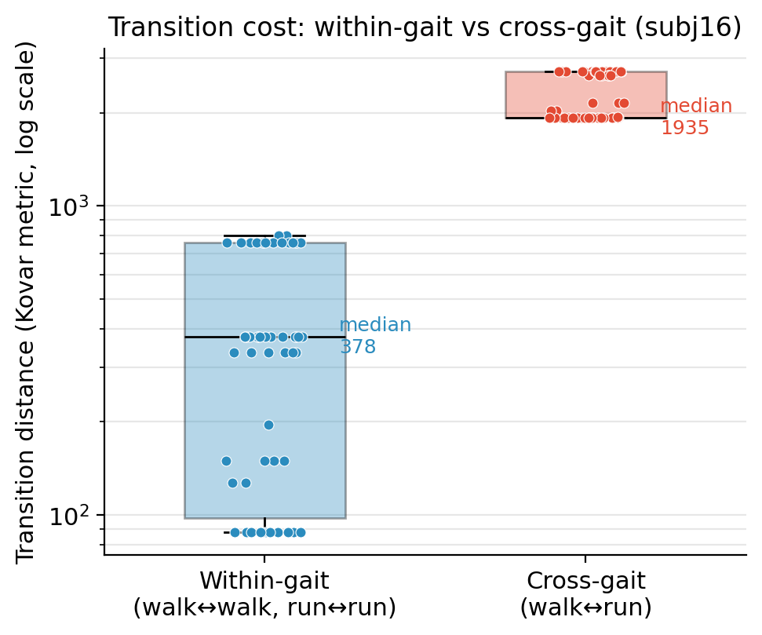
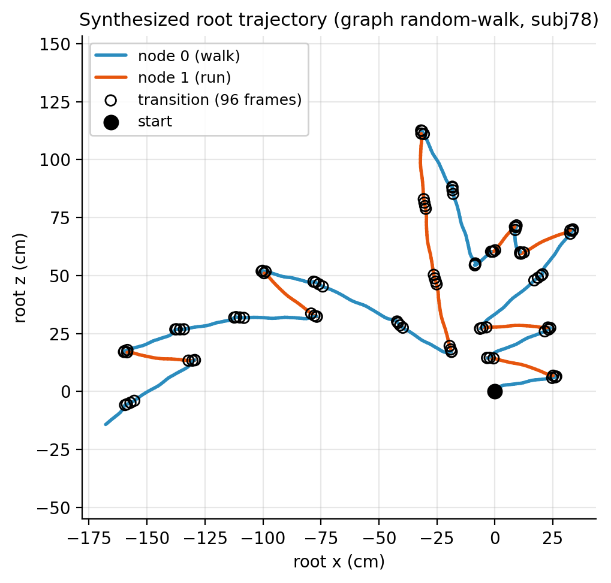

# Parametric Motion Graphs — Implementation Report

*An interactive motion-synthesis viewer built after Heck and Gleicher's Parametric Motion Graphs.*

This project implements a PMG-style motion-synthesis pipeline in which short BVH
examples are organized into parameterized motion spaces, connected through
sampled transition edges, and visualized through an interactive viewer. The
final demonstration focuses on stable parametric motion blending and
transition-quality diagnostics rather than claiming a complete reproduction of
the original PMG system. Concretely, the implementation delivers four things:
(1) parameterized motion blending, (2) graph- and spec-driven transition
construction, (3) transition-quality diagnostics, and (4) interactive viewer
visualization.

---

## 1. Introduction

A short captured motion clip, played back on its own, is a poor source of long
and controllable character motion. The clip ends after a second or two, and it
exposes no continuous control over where the character goes or how fast it
moves. Two established families of techniques address different halves of this
problem. Motion graphs connect many clips into a graph whose walks produce
arbitrarily long motion streams, but because the underlying units are discrete
clips, continuous control is weak: the character can only do what some recorded
clip already did. Parametric synthesis, in the other direction, blends a small
set of similar examples to generate motion for a continuously varying parameter,
but a single parametric space offers no principled way to move to a *different*
kind of motion.

Parametric Motion Graphs combine the two. A node is no longer a single clip but
an entire parameterized motion space, and a directed edge encodes a valid
transition from one such space into another. The result is a structure that
supports continuous control *within* a motion family and discrete, quality-gated
transitions *between* families.

This report follows that structure. BVH clips are loaded and grouped into
parameterized motion spaces; graph specification files define the nodes and the
transitions between them; and the viewer exposes parameter control, generated
clips, and diagnostic visualization. The emphasis throughout is on what the
implementation can demonstrate stably and measure honestly.

---

## 2. Background: Parametric Motion Graphs

### 2.1 Blending-based parametric motion synthesis

PMG generates motion within a family by blending. A set of examples of the same
kind of motion — for instance, several walks — is placed in a parameterized
space, each example annotated with the parameter value it realizes. Given a
query parameter, the system blends the nearby examples to synthesize a new clip
for that query. Within one family this yields continuous control over a small
number of intuitive parameters.

In this implementation, the file `specs/demo_walk_2d.pmg_spec` defines a single
walking motion space parameterized by two axes, `turn_rate` and `travel_speed`.
Four walking examples serve as anchors. A query parameter generates a new walk by
interpolating the nearby anchors, with the blend weights produced from a
piecewise-linear inverse-calibration grid (nine knots per axis) so that the
achieved parameter tracks the requested one.

### 2.2 Motion graphs and transition edges

Classical motion graphs represent transitions between individual clips as edges.
PMG raises the level of abstraction: an edge connects two parameterized motion
*spaces*, not two clips, and encodes the set of valid transitions from the source
space into the target space. A node is therefore a continuous region of motion,
and an edge is a quality-gated bridge between two such regions.

This implementation realizes the graph layer through specification files such as
`specs/cmu_gait_graph.pmg_spec` (a subject-16 walk/run graph) and
`specs/cmu78_gait_graph.pmg_spec` (a subject-78 walk/run graph). The graph stores
nodes, self-edges, and cross-gait edges. Each candidate edge is evaluated by
sampling transition candidates between the source and target windows, and the
build records which samples are accepted or rejected together with their
transition cost.

### 2.3 PMG node/edge interpretation

The two ideas above fix the vocabulary used in the rest of this report. A
**node** is a parameterized motion space (a walk family, a run family), not a
single BVH clip. An **edge** is a directed, quality-checked transition from one
node into another, constructed by sampling candidate transitions and keeping only
those whose transition cost is acceptable.

---

## 3. System Overview

The original PMG paper presents the system in three stages: building the graph,
extracting data from it, and using it for interactive control. The
implementation maps onto the same three stages.

| PMG paper component | This report (section) | Implementation |
| --- | --- | --- |
| Build PMG | Graph/Spec construction (§5) | `.pmg_spec` files, `pmg_cli --build-graph`, transition tables |
| Extract data | Runtime data / diagnostics (§5, §7) | edge-acceptance samples, transition-cost CSV, root-trajectory CSV |
| Use for control | Viewer / interaction (§6) | parameter sliders, trajectory overlay, Recenter, foot-lock preview |

The supporting components are a BVH loader and motion-clip representation, the
parametric motion space described in §4, the graph spec and graph builder
described in §5, and the interactive viewer and diagnostic tooling described in
§6. The CLI (`pmg_cli`) is the development surface used to build graphs and emit
diagnostics; the viewer is the everyday interactive surface.

---

## 4. Parametric Motion Space Implementation

The central demonstration is a walking motion space. The parameter vector is
**l = (turn_rate, travel_speed)**, and four walking clips, declared in
`specs/demo_walk_2d.pmg_spec`, serve as the examples:

| Example | turn_rate | travel_speed | Source clip |
| --- | --- | --- | --- |
| 1 | −0.3 | 0.0 | `walkMoreCurve.bvh` |
| 2 | 0.0 | 0.0 | `walkCurve.bvh` |
| 3 | 1.0 | 0.0 | `walkTightCurve.bvh` |
| 4 | 0.15 | 0.75 | `walkStraightTwiceAsFast.bvh` |

Changing **l** in the viewer generates a new walking clip by interpolating these
examples. This corresponds directly to the PMG node concept: the node is the
entire parameterized walking space, and the viewer query is a point inside it.

The two axes are not equally well supported, and the report treats them
accordingly. The `turn_rate` axis is anchored by three examples spanning a wide
turn to a tight turn and is the well-supported, primary control axis; a turn-rate
sweep moves the synthesized walk smoothly from a gentle to a sharp curve. The
`travel_speed` axis is supported by a single faster example reaching roughly
0.75, and the spec itself notes that pushing this anchor harder becomes a source
of blending artifacts rather than a usable walking speed. The `travel_speed` axis
is therefore presented as a secondary, limited-support control rather than as
evidence of a uniformly strong two-dimensional control space.

A second, deliberately honest point concerns how the examples come to exist. The
examples here are **manually curated** and declared in the spec file. The system
does not perform automatic extraction of motion families from a large motion
database; that automatic-authoring component of the original PMG is out of scope
(see §8.1).

---

## 5. Graph Construction and Transition Diagnostics

The hardest part of PMG is deciding when a transition between two motion spaces
is valid and encoding the result. The implementation approaches this by
sampling. For a given source node and target node, it samples candidate
transitions from the source motion's end window and the target motion's start
window, scores each candidate with a Kovar-style (directional) transition
distance, classifies the samples as good, neutral, or bad, and accepts the edge
when enough good samples exist. The build is driven from the CLI:

```
pmg_cli --build-graph specs/cmu_gait_graph.pmg_spec
```

### 5.1 Edge acceptance


In the subject-16 CMU graph, the four gait pairs behave very differently.
The within-gait pairs (walk→walk, run→run) and, notably, the cross-gait pair
walk→run are dominated by good samples — walk→run still yields roughly 37 good
samples out of 48. The reverse cross-gait pair, run→walk, is dominated by neutral
and bad samples, and four of its candidate edges are rejected during the build.
The behavior is therefore **directionally asymmetric**: a clean transition exists
from walking into running for this subject, while the reverse direction largely
fails to find acceptable candidates. This is a sharper statement than "cross-gait
transitions are bad," and it is the statement the data actually supports.

### 5.2 Within-gait versus cross-gait transition cost



For the same subject, within-gait transition candidates have a median Kovar
distance of 378, while cross-gait candidates have a median of 1935 — roughly a
five-fold separation on a log scale. The honest reading of this figure requires
naming two factors that it cannot separate:

1. **Gait-family mismatch.** A walking end-pose and a running start-pose are
   genuinely farther apart in pose space, which inflates the transition cost.
2. **Limited transition coverage.** Cross-gait candidates come from a sparser set
   of compatible source/target poses than within-gait candidates, so the higher
   measured cost is partly an artifact of having fewer close pairs to sample.

Both factors push in the same direction, and this diagnostic does not attribute
the gap to either one alone. What can be stated cleanly is the measured fact: in
the subject-16 CMU graph, within-gait transitions showed lower transition
distances than cross-gait transitions. No claim is made that this generalizes
beyond subject 16; the figure is built from a single subject.

---

## 6. Interactive Viewer

The viewer is the interactive surface for inspecting PMG components. It provides
parameter sliders that drive a motion-space query, a preview of the generated
clip, a top-down trajectory overlay, graph and random-walk diagnostics, skeleton
display scaling, and a Recenter control that snaps a CMU-scale skeleton back to
the origin for inspection.

The viewer also includes a **preview foot-lock** for generated clips. This is a
display and post-processing aid for clip preview: it locks the supporting foot of
a generated clip during stance to reduce visible foot-skate, and it does not
modify the underlying BVH data or the graph metrics. The foot-skate it addresses
is real and was measured directly. On a generated `demo_walk_2d` goto clip the
post-process lock reduces stance slide by 65% (from 0.191 to 0.067), and on a
subject-16 graph random-walk it reduces slide by 83% (from 0.630 to 0.109). These
numbers describe the display-time correction only; they are not a property of the
stored motion.

Separately, the spec-level **tolerant contact registration** used to build the
CMU walk space is what makes the lock effective. Naïve
registration loses all foot contact for several steps of a parameter sweep, so a
post-hoc lock would have nothing to lock; the tolerant registration holds at
least two contacts across the entire sweep, after which foot-lock cuts slide by
66% (to 0.183) on the blended result.

---

## 7. Results

The results below are organized as applications of the same pipeline, and they
distinguish carefully between **quantitative diagnostics** and **qualitative
demonstrations**.

### Result 1 — Parametric walking blend (qualitative)

Using `specs/demo_walk_2d.pmg_spec`, moving the `turn_rate` slider produces
visibly distinct walking motions, from a gentle curve to a tight turn, with the
preview foot-lock on for stable display. This is a **qualitative demonstration**
that the parametric node behaves as intended; no quantitative claim attaches to
the visual distinctness itself. The `travel_speed` axis is exercised only within
its limited support.

### Result 2 — Trajectory visualization (qualitative)



A random walk over the subject-78 two-node walk/run graph produces a connected
root trajectory in which the walk node (blue) and run node (orange) alternate,
joined by a 104-frame transition. The top-down trajectory figure gives a clearer
view of the generated root path than a raw viewer capture, and it confirms that
the graph layer produces a single continuous stream across a real node-to-node
transition.

### Result 3 — Transition-quality diagnostics (quantitative)

The edge-acceptance and transition-cost figures from §5 are the project's
**quantitative results**. For subject 16, within-gait transitions had a median
Kovar distance of 378 against 1935 for cross-gait, and the cross-gait acceptance
was directionally asymmetric (walk→run largely accepted, run→walk with four edges
rejected). These are measured diagnostics of the graph build, reported for a
single subject and not generalized beyond it.

### Result 4 — Self-contained CMU demo

The CMU demonstrations run on real mocap-scale BVH that ships directly in the
repository's `BVH/` directory, with the specs `specs/cmu_walk_1d.pmg_spec`,
`specs/cmu_gait_graph.pmg_spec`, and `specs/cmu78_gait_graph.pmg_spec` referring
to those local files. The clips load without any external fetch step, so the
entire pipeline — parametric walk space, graph build, and diagnostics — is
reproducible from the checked-in data (the regeneration scripts in
`docs/figures/` additionally require a built `pmg_cli`).

---

## 8. Limitations and Future Work

### 8.1 Not a full automatic PMG authoring system

The system uses manually curated BVH clips and hand-written spec files. It does
not implement the automatic extraction of motion families from a large motion
database that the original PMG describes. The parameterization and example
selection are authored, not discovered.

### 8.2 Cross-gait transition coverage

Cross-gait transitions are possible but coverage-limited, and the limitation is
directional. For subject 16 the walk→run direction is well covered while the
run→walk direction largely fails, and the transition-cost diagnostic cannot
separate genuine gait-family mismatch from sparse sampling. Broader and more
balanced transition coverage — more compatible source/target windows, and more
subjects — is the natural next step.

### 8.3 Runtime traversal visual quality

The graph runtime can produce traversal streams, but live traversal currently
streams raw poses, and a fully clean recording would require a bake-and-lock
replay pass. Because of this, the final demonstration emphasizes stable
generated-clip preview and the diagnostic graph evidence rather than a continuous
live-traversal capture.

### 8.4 Skeleton and unit consistency

Different BVH datasets use different skeleton scales. The implementation keeps
each spec internally consistent and does not blend clips from different skeletons
or unit scales within a single node. CMU clips are centimeter-scale and are
handled through viewer display scaling and recentering only, not by mixing them
into a node built from a differently scaled skeleton.

### 8.5 Future work

Beyond broadening transition coverage and adding a clean bake-and-lock runtime
replay, two extensions follow naturally: source-range restriction during edge
construction, so that only the part of a source node that can actually transition
is exposed on an edge, and a larger multi-subject evaluation so that the
transition-quality findings can be stated beyond a single subject.

---

## 9. Conclusion

This project implements the main structure of PMG-style motion synthesis: short
BVH examples are organized into parameterized motion spaces, those spaces are
connected through sampled and quality-gated transition edges, and the whole
pipeline is made inspectable through an interactive viewer. The stable, defensible
results are the parametric walking blend, the connected graph trajectory, and the
transition-quality diagnostics, supported by direct measurements — a five-fold
within-versus-cross transition-cost separation and a 65–83% reduction in
display-time foot-skate for the subject-16 graph. The work does not claim a
complete reproduction of the original PMG system; it claims a faithful
implementation of its core structure with honestly bounded, measured evidence.
